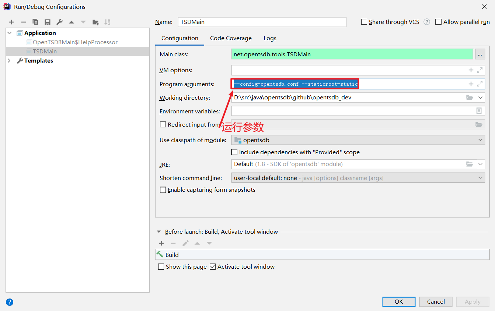

# opentsdb_dev
## 开发环境

```
opentsdb官方的工程管理通过：make、automake、autoconfig管理，这里将原有的工程管理方式修改为maven,以下为通过idea运行时，需要注意的地方。
```




## 新需求

使用opentsdb时，在已有功能的基础上提出了新需求：

- 历史原始值数量统计：
  - 原有接口支持统计某个测点在某段时间内的历史原始值数量，现需要知道opentsdb中所有历史原始值的总数，用于性能测试时预测磁盘空间大小。
- metric支持修改：
  - 应用过程中，设备长名通过metric表示(eg. metric="/tenant/region/station/device")；时序数据三元组：质量戳、值通过tagk、tagv表示(eg. tagk="quality",tagv=192；tagk="value",tagv=11.0)，时间戳通过row来表示。现遇到如下问题：当metric被修改时，测点的历史数据丢失；

